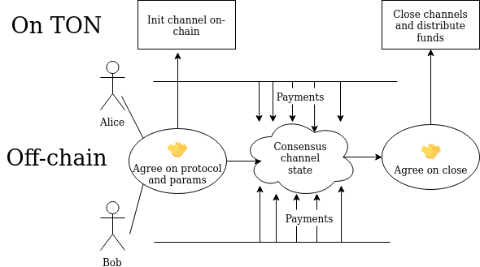
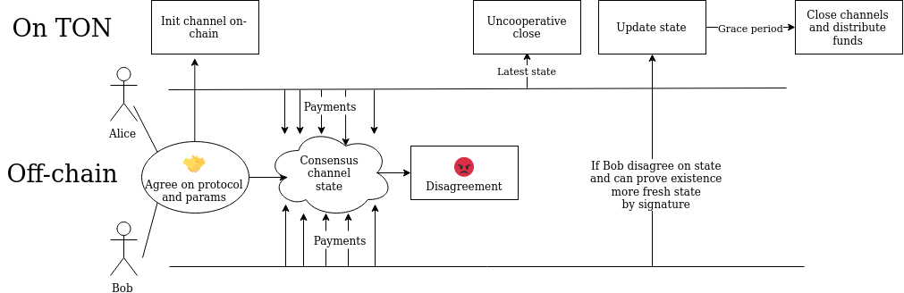

# Asynchronous payment channel

## Building and testing
Build requires state-of-the-art version of [func](https://github.com/ton-blockchain/ton/pull/378). Testing requires toncli-local version of [func](https://github.com/SpyCheese/ton/tree/toncli-local) for func-level signing support.

## Background
Theoretical background is given in [Section 5 of TON.pdf](https://ton-blockchain.github.io/docs/ton.pdf#page=111)

## Purpose
The purpose of payment channel is to give two parties make a series of payments instantaneously, free of charge, without necessety to commit all transactions into the blockchain and with reasonable guarantees. While both parties stick to protocol there is no reason to do anything on-chain. If any party violates protocol (or stop responding) channel can be closed by other party with the division of funds according to the latest consensus.

## High-level Scheme
### Cooperative scheme

* parties agree on protocol
* lock some mutual funds on-chain
* make back and forth off-chain payments by reaching consensus about current state of the channel. In particular which share of mutual funds is owned by first party and which by second. To do so, parties interchange states with signatures which confirm payments.
* commit some intermediate state if any party expected to go offline
* close channel and distribute funds when not needed anymore

### Uncooperative scheme

* parties agree on protocol
* lock some mutual funds on-chain
* make back and forth off-chain payments by reaching consensus about current state of the channel. In particular which share of mutual funds is owned by first party and which by second. To do so, parties interchange states with signatures which confirm payments.


**Something goes wrong and parties can not agree on consensus**

* any party may initiate uncooperative payment closure. To do so it submit latest known states signed by parties.
* if closure initiator cheats by submitting not latests state, the couterparty can prove misbehavior by submitting later state during grace period
* after grace period, latest submitted state is considered as final and funds are distributed accordingly.

## Low-level Scheme

Inner state of channel consist of two semi-channels `A->B` and `B->A`. Each semi-channel contains:
* seqno
* total amount of sent TONs (or other assets)
* list of conditional payments (payments which can be claimed if couterparty satisfy condition, for instance provide hash preimage)
* seqno of recent known counterparty semi-channel state

Note, that seqnos as well as sent amount are only goes up with time.

To make payment (and convince the counterparty) party need to sign it's new semi-channel state with increased seqno and increased amount sent. With that data counterparty can always enforce payment onchain thus it may consider payment confirmed.

Payment channel contract has the following handlers:
* `top_up_balance` Optional step when parties may deposit on their side of the channel
* `init_channel` Init channel and set initial funds distribution (may be combined with deploy).
* `cooperative_close` Given that both parties signed close request with final state, closes channel and distribute funds
* `cooperative_commit` Given that both parties signed seqnos of current state, commits those seqnos to contract storage. That way previous states with earlier seqno's become invalid
* `start_uncooperative_close` Initiates process of uncooperative closure. Party which initiates closure submit it's version of final state. Note, some grace period, determined by channel config, is given to counterparty to dispute the final state.
* `challenge_quarantined_state` Allows counterparty to challenge final state submitted by uncooperative closure initiator: if it is able to provide later state signed by initiator, it means that closure initiator try to cheat and, depending on channel config, it may be fined for misbehavior. Final state is substituted with new one, grace period prolonged.
* `settle_conditionals` - after final state is settled down there is additional period to settle down conditional payments: counterparty may provide data required by condition, it will remove this condition from the list and increase sent amount.
* `finish_uncooperative_close` - after state and conditionals are settled down, this handler closes channel and distribute funds in accordance to final state.


# Interaction protocol
Note, protocol describes off-chain interaction between parties and thus is not forced by channel logic. Still we provide some recommendation on protocol here.

1. Channel initiation. It is expected that in most cases channel is initiated with all funds owned by one party to pay to another (payer and payee). In this case
   * payer should ask for payee public key, withdrawal address and negotiate about config params (duration of grace periods, channel_id etc).
   * payer should calculate channel address and send it to payee for confirmation. Payee calculate channel address as well and if parties agree on address, send confirmation to payer
   * payer should deploy channel and initiate it (maybe done in one tx)
   * payee checks that contract is properly initiated
2. Off-chain interaction, simple payment.
   * Party which want to send payment should generate new semi-channel state with increased seqno and sent amount, sign it and then send to counterparty (optionally with some metadata describing the payment).
   * Payee should check obtained semi-channel by checking signature, correct serialization, seqno is higher than previous one, detect sent amount by difference in `sent` field, conditionals payment list contains valid and expected values (in particular this list is not too big or too deep to allow uncooperative closure), and that referenced semi-channel state was indeed issued by payee.
   * Payee should confirm payment by sending it's own signed semi-channel state with increased seqno and reference to just received state.
   * If payee can not validate received state there are two options. Simple one is to immediately initiate channel closure process. The alternative option is the following: payee generates expected counterparty semi-channel state with `sent` and `conditionals` corresponding to the state prior rejected one, and seqno higher than that in rejected one. Then it generates it's own semi-channel state and reference to newly created semi-channel state. Then it sens this state to payer (this way payer may be sure that rejected state is indeed rejected and can not be used).
3. Temporal halt in work. When one party expect to go off-line for some time it may initiate process of current state commitment. That allows to safely halt operation without channel closure and risks of counterparty misbehaviour.
   * Commit initiator should sign current up-to-date seqnos and send to counterparty
   * Counterparty should check that seqnos are indeed up-to-date, sign them as well and send message to the channel smart-contract on-chain
4. Uncooperative closure. If something went wrong and parties can not reach consensus, any of them may start uncooperative closure process. This process only include on-chain interaction (no off-chain interactions required)
   * To do that it should get latest semi-channel states signed by each party and submit it to the channel smart-contract on-chain
   * It also should schedule timer for settling conditionals (if any) and to channel closure after corresponding timeouts will end.

Note, any party before sending signed semi-channel state should save it to disk. Thus, in case of accidental interruption, it will not lose track of already signed states. It is important because submitting outdated state is misbehavior and may be fined.

Also, each party of the channel should constantly monitor wheter the channel is in uncooperative closure state. If it founds that closure is started, it should immediately stop off-chain interaction and check whether submitted to channel state is relevant (and take action if it's not).

# Contract interface
Full TL-B scheme of contract storage, data structures and messages is avaliable in [scheme.tlb](scheme.tlb).

Basic blocks used in interface are as following:
1. `cp#_ amount:Coins condition:Cell = ConditionalPayment;` Conditional payment contains amount of coins in question followed by slice with code. This code should contain `(slice -> int)` function which return bool whether condition is met. Note, code will be executed only being authorized by both parties.
2. `sc_body#_ seqno:uint64 sent:Coins conditionals:(HashmapE 32 ConditionalPayment) = SemiChannelBody; ` Semi-channel body, containse seqno, amount of unconditionnaly sent tokens and `HashmapE` of conditional payments.
3.  `semichannel_state#43685374 data:SemiChannelBody counterparty_data:(Maybe SemiChannelBody) = SemiChannel;` Semi-channel differs from Semi-channel body by tag and optional latest known counterparty Semi-channel body.
4.  `signed_schs#_ signature:bits512 state:SemiChannel = SignedSemiChannel;` Signed semi-channel state, signature covers everything after that (`state`).


Internal message handlers:
0. `top_up_balance`:`top_up_balance#67c7d281 add_A:Coins add_B:Coins = InternalMsgBody;`
1. `init_channel`: `init_channel#0e0620c2 is_A:Bool signature:bits512 tag:# {tag = 0x696e6974} channel_id:uint128 balance_A:Coins balance_B:Coins = InternalMsgBody;` signature should cover everything after it: tag, channel_id, balances.
2. `cooperative_close`: *Can be external* `cooperative_close#5577587e sig_A:^bits512 sig_B:^bits512 tag:# {tag = 0x436c6f73} channel_id:uint128 balance_A:Coins balance_B:Coins seqno_A:uint64 seqno_B:uint64 = InternalMsgBody;` signatures should cover everything after them: tag, channel_id, balances.
3. `cooperative_commit` :  *Can be external*  `cooperative_commit#79a126ef sig_A:^bits512 sig_B:^bits512 tag:# {tag = 0x43436d74} channel_id:uint128 seqno_A:uint64 seqno_B:uint64 = InternalMsgBody;` signatures should cover everything after them: tag, channel_id, seqnos.
4. `start_uncooperative_close`: root signature should cover everything after it: tag, channel_id, semichannel states
```start_uncooperative_close#1f151acf signed_by_A:Bool signature:bits512 tag:# {tag = 0x556e436c} channel_id:uint128
                    sch_A:^SignedSemiChannel
                    sch_B:^SignedSemiChannel = InternalMsgBody;
```
5. `challenge_quarantined_state`: root signature should cover everything after it: tag, channel_id, semichannel states
```challenge_quarantined_state#088eaa32
                        challenged_by_A:Bool signature:bits512 tag:# {tag = 0x43686751} channel_id:uint128
                        sch_A:^SignedSemiChannel
                        sch_B:^SignedSemiChannel = InternalMsgBody;
```
6. `settle_conditionals`: root signature should cover everything after it: tag, `channel_id`, `conditionals_to_settle`
```settle_conditionals#66f6f069
                      from_A:Bool signature:bits512 tag:# {tag = 0x436c436e} channel_id:uint128
                      conditionals_to_settle:(HashmapE 32 Cell)
                      = InternalMsgBody;
```
7. `finish_uncooperative_close`:  *Can be external* `finish_uncooperative_close#25432a91 = InternalMsgBody;`


# Payment Channel Network
While payment channels are great for makinginstant and free of charge payments between given two parties, it can not be used between arbitrary partirs which not yet settled channel contract on-chain. This problem may be solved by network of payment channels, when party A may send tokens to party E through the chain of A->B, B->C, C->D, D->E channels. To make such payment trustless and safe conditional payments can be used. For instance A and E agrees on some `seed` and calculate `hash` of the seed.
Then A says to B that it conditionally gives it tokens if B shows any number which after hashing is equal to `hash`, also A asks the B to make conditional payments to C with the same condition (and slightly smaller sum, thus B gets fee). This chain of conditional payment is stretched through all hops. Each party is safe: if for instance C forces conditional payment form B, it means that it revealed `seed`, thus it means that B know seed and may force conditional payment from A.

Given that conditions may be arbitrary, there are endless ways of using such payment network including multi-route payments and cross-chain swaps.

# Compiled code
June 30 2022, 21:00
```
B5EE9C72410230010007FB000114FF00F4A413F4BCF2C80B0102012002030201480405000AF26C21F0190202CB06070201202E2F020120080902012016170201200A0B0201200C0D0009D3610F80CC001D6B5007434C7FE8034C7CC1BC0FE19E0201580E0F0201201011002D3E11DBC4BE11DBC43232C7FE11DBC47E80B2C7F2407320008B083E1B7B51343480007E187E80007E18BE80007E18F4FFC07E1934FFC07E1974DFC07E19BC01887080A7F4C7C07E1A34C7C07E1A7D01007E1AB7807080E535007E1AF7BE1B2002012012130201201415008D3E13723E11BE117E113E10540132803E10BE80BE10FE8084F2FFC4B2FFF2DFFC02887080A7FE12BE127E121400F2C7C4B2C7FD0037807080E53E12C073253E1333C5B8B27B5520004D1C3C02FE106CFCB8193E803E800C3E1096283E18BE10C0683E18FE10BE10E8006EFCB819BC032000CF1D3C02FE106CFCB819348020C235C6083E4040E4BE1124BE117890CC3E443CB81974C7C060841A5B9A5D2EBCB81A3E118074DFD66EBCB81CBE803E800C3E1094882FBE10D4882FAC3CB819807E18BE18FE12F43E800C3E10BE10E80068006E7CB8199FFE187C0320004120843777222E9C20043232C15401B3C594013E808532DA84B2C7F2DFF2407EC02002012018190201D42B2C0201201A1B0201201E1F0201201C1D00E5473F00BD401D001D401D021F90102D31F01821043436D74BAF2E068F84601D37F59BAF2E072F844544355F910F8454330F910B0F2E065D33FD33F30F84822B9F84922B9B0F2E06C21F86820F869F84A6E915B8E19F84AD0D33FFA003171D721D33F305033BC02BCB1936DF86ADEE2F800F00C8006F3E12F43E800C7E903E900C3E09DBC41CBE10D62F24CC20C1B7BE10FE11963C03FE10BE11A04020BC03DC3E185C3E189C3E18DB7E1ABC032000B51D3C02F5007400750074087E4040B4C7C0608410DB1BDCEEBCB81A3E118074DFD66EBCB81CBE111510D57E443E1150CC3E442C3CB8197E80007E18BE80007E18F4CFF4CFCC3E1208AE7E1248AE6C3CB81B007E1A3E1A7E003C042001C1573F00BF84A6EF2E06AD2008308D71820F9012392F84492F845E24130F910F2E065D31F018210556E436CBAF2E068F84601D37F59BAF2E072D401D08308D71820F901F8444130F910F2E06501D430D08308D71820F901F8454130F910F2E06501820020120222301FED31F01821043685374BAF2E068F84601D37F59BAF2E072D33FFA00F404552003D200019AD401D0D33FFA00F40430937F206DE2303205D31F01821043685374BAF2E068F84601D37F59BAF2E072D33FFA00F404552003D200019AD401D0D33FFA00F40430937F206DE23032F8485280BEF8495250BEB0524BBE1AB0527ABE19210064B05215BE14B05248BE17B0F2E06970F82305C8CB3F5004FA0215F40015CB3F5004FA0212F400CB1F12CA00CA00C9F86AF00C01C31CFC02FE129BACFCB81AF48020C235C6083E4048E4BE1124BE1178904C3E443CB81974C7C0608410DA19D46EBCB81A3E118074DFD66EBCB81CB5007420C235C6083E407E11104C3E443CB81940750C3420C235C6083E407E11504C3E443CB81940602403F71CFC02FE129BACFCB81AF48020C235C6083E4048E4BE1124BE1178904C3E443CB81974C7C0608410DB10DBAEBCB81A3E118074DFD66EBCB81CBD010C3E12B434CFFE803D0134CFFE803D0134C7FE11DBC4148828083E08EE7CB81BBE11DBC4A83E08EF3CB81C34800C151D5A64D6D4C8F7A2B98E82A49B08B8C3816028292A01FCD31F01821043685374BAF2E068F84601D37F59BAF2E072D33FFA00F404552003D200019AD401D0D33FFA00F40430937F206DE2303205D31F01821043685374BAF2E068F84601D37F59BAF2E072D33FFA00F404552003D200019AD401D0D33FFA00F40430937F206DE230325339BE5381BEB0F8495250BEB0F8485290BEB02502FE5237BE16B05262BEB0F2E06927C20097F84918BEF2E0699137E222C20097F84813BEF2E0699132E2F84AD0D33FFA00F404D33FFA00F404D31FF8476F105220A0F823BCF2E06FD200D20030B3F2E073209C3537373A5274BC5263BC12B18E11323939395250BC5299BC18B14650134440E25319BAB3F2E06D9130E30D7F05C82627002496F8476F1114A098F8476F1117A00603E203003ECB3F5004FA0215F40012CB3F5004FA0213F400CB1F12CA00CA00C9F86AF00C00620A8020F4966FA5208E213050038020F4666FA1208E1001FA00ED1E15DA119450C3A00B9133E2923430E202926C21E2B31B000C3535075063140038C8CB3F5004FA0212F400CB3F5003FA0213F400CB1FCA00C9F86AF00C00D51D3C02FE129BACFCB81AFE12B434CFFE803D010C74CFFE803D010C74C7CC3E11DBC4283E11DBC4A83E08EE7CB81C7E003E10886808E87E18BE10D400E816287E18FE10F04026BE10BE10E83E189C3E18F7BE10B04026BE10FE10A83E18DC3E18F780693E1A293E1A7C042001F53B7EF4C7C8608419F1F4A06EA4CC7C037808608403818830AEA54C7C03B6CC780C882084155DD61FAEA54C3C0476CC780820841E6849BBEEA54C3C04B6CC7808208407C546B3EEA54C3C0576CC780820840223AA8CAEA54C3C05B6CC7808208419BDBC1A6EA54C3C05F6CC780C60840950CAA46EA53C0636CC78202D0008840FF2F00075BC7FE3A7805FC25E87D007D207D20184100D0CAF6A1EC7C217C21B7817C227C22B7817C237C23FC247C24B7817C2524C3B7818823881B22A021984008DBD0CABA7805FC20C8B870FC253748B8F07C256840206B90FD0018C020EB90FD0018B8EB90E98F987C23B7882908507C11DE491839707C23B788507C23B789507C11DE48B9F03A4331C4966
```
